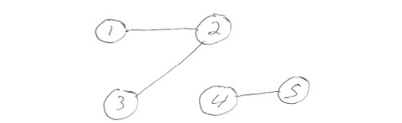
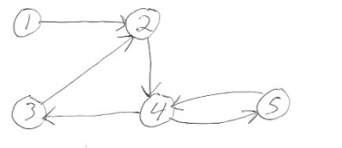
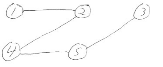
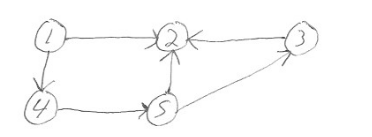
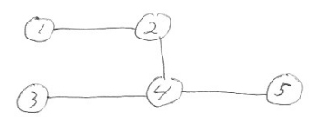
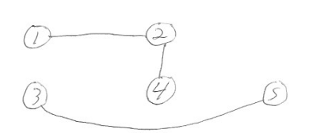
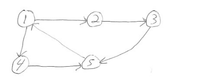
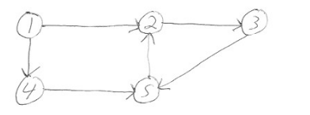

-------------
Graphs
-------------

# Definition

G = (V,E) is a graph.

V - finite set, the vertices or nodes
E - finite set, the edges, is a subset of V x V = {(a,b) | where a,b are both in V}

## Example



V = {1,2,3,4,5}
E = {(1,2), (2,3), (4,5)}

Here, G = (V,E) = ({1,2,3,4,5}, {(1,2), (2,3), (4,5)}).

# Undirected Graph
The above is an **undirected graph**, with the edges going both ways. That is, (1,2) = (2,1), and the edge can take you from 1 to 2 or from 2 to 1.

# Directed Graph

A **directed graph** is similar, except the edges are directed.



V = {1,2,3,4,5}
E = {(1,2), {3,2),(4,3),(4,5),(5,4),(2,4)}
G = (V,E) = ({1,2,3,4,5}, {(1,2), {3,2),(4,3),(4,5),(5,4),(2,4)})

Here, (1,2) != (2,1) and (1,2) indicates that you can go from 1 to 2.

# Paths

Let G = (V,E) and u, w be vertices in set V. A **path** from u to v is a **sequence or ordered list** of edges from u to w. That is, there are vertices v_1, v_2, v_3, ... v_m contained in set V, such that:

1. u = v_1
2. w = v_m
3. (v_i, v_i+1) is an edge contained in set E, for i = 1, 2, ..., m-1

## Path Example

In the undirected graph below, there is a path from 1 to 3 (and likewise a path from 3 to 1):



path from 1 to 3: (1,2),(2,4),(4,5),(5,3)

Since the graph is undirected, there is a path from 3 to 1:
(3,5)(5,4)(4,2)(2,1)

# Directed Graphs can be more involved

In the directed graph below, there is a path from 1 to 3, but no path from 3 to 1.



path from 1 to 3: (1,4),(4,5),(5,3)

# Connected Graphs

An undirected graph is called **connected** if there is a path between each pair of vertices.

# Strongly Connected Graphs

A directed graph is called **strongly connected** if there is a path between each pair of vertices.

## Examples



This undirected graph is connected.



This undirected graph is not connected, since there is no path between 1 and 5 for instance.




This directed path is strongly connected.



This directed graph is not strongly connected, since there is no path from 5 to 1 for instance.

# Programming Assignment 4

For programming assignment 4, we will be creating a graph class and implementing methods to:
1. add vertices,
2. add edges, and 
3. determining if the graph is connected.

# Determining Connectedness in an undirected Graph

Let G = (V,E) be an undirected graph. Let S be a set and T be a queue. Recall Java has classes for both sets and queues.

We are going to use S as the set of vertices of G that are connected to some starting vertex.

We are going to use T as the list of Vertices still needing to be searched for edges to vertices that are not currently in S.

We will assume T.poll returns and removes the element of T at the front of T.

Below is an algorithm to determine if an undirected graph is connected, obviously in pseudo code:

Note: S and T are initialized with some starting vertex.
By definition, S is always connected during the algorithm and if it eventually is equal to V, then entire graph G is connected.

``` java
while T is not empty:
	let x = T.poll
	for each element of E:
		if x is one of the vertices of the current edge:
			if the other vertex, y, is not in S:
				add y to both S and T

if S = V, then G is connected.
```

# Naming conventions

Note: If (u,w) is an edge in E, we typically call u the **from vertex** and w the **to vertex**. For undirected graphs, the order of u and w in (u,w) = (w,u) does not matter.

# Algorithm Limitations 

Note: The algorithm shown above for determining if an undirected graph is connected does not work for directed graphs. But, we can make a minor modification and use it twice to determine if a directed graph is strongly connected.

# Determining if a Directed Graph is Strongly Connected

Let G = (V,E) be a directed graph. Define E_compliment as the reverse edges of G. That is, E_compliment is a copy of E in which the two vertices are swapped in each edge. 

For example:

if E = {(1,2), (1,4), (2,3)} then:
E_compliment = {(2,1), (4,1), (3,2)}

If we call the function below algorithm twice, once with E and once with E_compliment, and both calls return true, then G is strongly connected.

Once again, S is a set and T is a queue. Both are initialized to a single starting vertex.

Assume V and E are provided, with V the set of vertices of a directed graph and E either the edges or reverse edges of the graph.

```java
while T is not empty:
	x = T.poll
	for each edge (u,w) in E:
		if x = u and w is not in S:
			add w to both S and T
			
if |V| = |S| return true, otherwise return false
```


