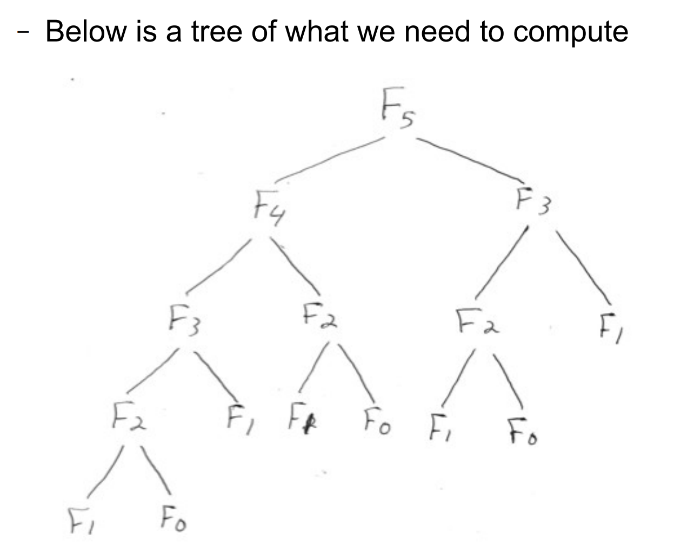

---------------
Recursion
---------------

In computer science, a recursive function is a function that ***calls itself*** to perform a computation.

## The factorial example

An seemingly natural example of such a function is the ***factorial function***. If n is a positive integer, then n factorial, written as n! , is simply n x (n-1) x (n-2) x ... x 2 ... x 1.

- It is also defined as n! = n x (n-1)!, as long as we define 0!

By convention, we define:

```java
//Base case
0! = 1
1! = 1 (obviously)
//And so for all postive integers n, we have:
//Recursive case
n! = n x (n-1) !
```
## Implementing factorial recursively

Here is how we could implement factorial in Java, using recursion:

```java
public static long factorial(long n)
{
	//base case
	if( n == 0 )
	{
		return 1;
	}

	//recursive case
	return n * factorial(n-1);
}
```

## Stack Overflow

The base case ```n == 0``` stops the function from continuing forever.
Each time a function calls itself, our stack grows for each recursive call. 

If we did not have a base case, then the function could infinitely recurse forever, which would cause what we call ***stack overflow***.

Note that in particular, our function assumes that the parameter is a ***non-negative number***. But, what happens if we did pass a negative number in, say for example, n = -1? The stack trace would look something like so:

```
factorial(-1); //n is not zero, we hit the recursive case
factorial(-2); //n is not zero, we hit the recursive case
factorial(-3); //n is not zero, we hit the recursive case
factorial(-4); //n is not zero, we hit the recursive case

//This will continue forever, until we wrong out of memory allowable for our java program. 
//Ultimately, we will get stack overflow as a result of bad recursion here.
```

## A fix for Stack Overflow

To fix this issue, we could do the following:

```java
public static long factorial(long n) throws IllegalArgumentException
{
	//Dealing with negative case
	if(n < 0)
	{
		throw new IllegalArgumentException("Error. We do not support computing the factorial of a negative number: " + n);
	}

	//base case
	if( n == 0 )
	{
		return 1;
	}

	//recursive case
	return n * factorial(n-1);
}
```

Now, our factorial function explicitly throws an `IllegalArgumentException` if the user tries to compute the factorial of a negative number.

- This does two things, first it prevents stack overflow. And two, it makes it clear to the user the limitations of our factorial implementation here.

## Thinking recursively

- Some functions just naturally seem to want to be implemented in a recursive manner.
- Typically, it involves problems that can be solved by breaking the problem up into similar sub problems.
- Factorial is the most obvious one, since the nth case is defined in terms of the (n-1) th case, as we saw above.

## Implementing the sum recursively

Another natural function to implement recursively, is the sum of all non-negative integers <= n.

That is, n + (n-1) + ... + 1 + 0.

- Let's call this function `sum(n)`.

We can implement `sum(n)` as a recursive function also. Thinking recursively, we can break up a summation into sub summations via this recursive definition:

```
//recursive case
sum(n) = n + sum(n-1)
//base case, sums typically start at zero
sum(0) = 0
```

Of course, it is a well known fact that:

sum(n) = n*(n+1) / 2, which can be proved via mathematical induction.

This would obviously be more efficient than calculating the sum recursively, but we mention this example anyway.


## Recursion relies heavily on the stack

When a recursive function executes, each succesive call to the function uses ***stack memory***, which is much smaller than ***heap memory***.

- On my laptop, somewhere around `sum(10960)` my java runtime ran out of stack space and stopped functioning.

The java runtime option -Xss can be used to increase the **stack size**, using -Xss400M sets the stack size to 400M. This allowed the sum to work for larger input values.

- I stopped trying at 1,000,000.

**An aside:** The -Xmx option sets the ***maximum heap size***.


## The fibonacci numbers 

Sometimes, recursive definitions can involve more than one base case. A natural example would be the fibonacci numbers, which are defined by the following sequence:

```
//Base cases
F_0 = 0
F_1 = 1
//Recursive case
F_n = F_(n-1) + F_(n-2), for n > 1
```

- This can be implemented as a recursive function. However, due to the number of recursive calls involved, it gets ***slow very quickly***.

- For example, even for a small case, say the 5th Fibonacci number, our stack already is being heavily utilized, and often computing redundant sub problems more than once:



## Fibonacci implementation

Here's a recursive definition:

```java
public static long fibonacci(long n)
{
	//base cases
	if( n == 0 || n == 1)
	{
		return n;
	}

	//recursive case
	return fibonacci(n-1) + fibonacci(n-2);
}
```

## Limitations of Recursion

**Motivation**

As we have seen, recursion is great for problems that can be broken up into smaller subproblems. Thinking recursively is a skill, which can help break a complex problem down into simpler pieces.

**Limitations**

- We also saw that we can run into issues with infinite recursion, stack overflow, and potentially slower computations as well.

- We saw that stack overflow can occur, even without infinite recursion happening. 

**Solutions**

- **Solution to Infinite recursion:** Making sure our recursive function will always reach some base case will stop infinite recursion from happening.

- **Solution to stack size issue:** Sometimes increasing the stack size can help mitigate the stack growing to large with these recursive functions.

- **Solution to efficiency issue:** We could make our recursive function more efficient by storing the results of sub problems. This is called **amortization**.

## Amortized Fibonacci

Here is the fibonacci sequence, but made more efficient. We still use recursion, however, note that we are only calculating each sub problem one time. Once a sub problem is solved, it is stored in some data structure, in this case, an array.

- We see that in order to be more efficient, the trade off is we need to utilize more storage. We call this space complexity. We are lowering our time complexity by increasing our space complexity.

```java
	private static void fib_helper(long[] fib_nums, int i)
	{
		//This stops infinite recursion,
		//and also ensures we don't get an ArrayIndexOutOfBoundsException.
		if(i < fib_nums.length)
		{
			//base cases
			if(i == 0 || i == 1)
			{
				fib_nums[i] = i;
			}
			//general case
			else
			{
				fib_nums[i] = fib_nums[i-1] + fib_nums[i-2];
			}

			//leveraging recursion 
			//we specify to calculate the (i+1)th fibonacci number
			
			//Since we stop recursion when the whole array is populated, this is valid.
			fib_helper(fib_nums, i+1);
		}
	}

	public static long fibonacci_amortized(int n)
	{
		//amortize - utilize more space
		long[] fib_nums = new long[n+1];

		//recursive helper.
		//Note the second parameter, specifies the 0th fibonacci 
		//number is to be calculated first.
		fib_helper(fib_nums, 0);

		return fib_nums[n];
	}
```


