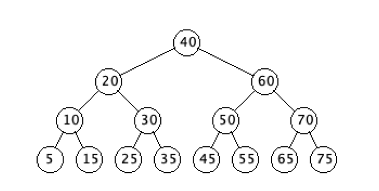

------------
Trees
------------

There are multiple definitions of a tree.

For us, let's use the following:

## Definition:

A ***tree*** is a connected, directed graph containing a special node, called the ***root***, in which all edges go away from the root.

- A tree is ***connected***, not strongly connected.
- All vertices can be reached from the root.
- There are no cycles (Cycles are paths in which the first and last nodes are the same).

Since all of the directed edges go away from the root, we do not need to include the direction.

- As long as we know what node is the root.
- A tree is typically drawn with the root at the ***top***, and the edges going ***down***.

## Some terminology

- Nodes - we typically call the vertices in a tree ***nodes***
- Parent - a node that has edges leaving it
- Child - a node that has edges coming into it
- Leaf - a node that is not a parent, that is, it has no edges leaving it
- Height - the height of a tree is the length of a maximum length path of the tree.
- Ancestor - a node that can be reached by repeatedly looking at the parent of some child node.
- Descendant - a node that can be reached by repeatedly looking at the children of some parent node.

- **Note:** The root is the ancestor of all nodes in the tree, except for itself.

- **Note:** The root is the only node in a tree which does not have a parent.

## Example

- The root of the tree is 40
- The leaves are: 5, 15, 25, 35, 45, 55, 65, 75
- The parent of 5 and 15 is 10
- The height of the tree is 3
- The subtree rooted at 20 would be the node 20 and all of his descendants (ie his children, and all their children.)

## Trees can be thought of recursively

As you can see, we can think of a Tree in a recursive fashion: Trees are made up of smaller subtrees.

This means, they are an ideal candidate for us to implement via recursion.