----------------------
Binary Search Trees
----------------------

Much of the following information was derived from https://en.wikipedia.org/wiki/Binary_search_tree

## Definition

A ***binary search tree*** (BST) is a binary tree that stores a key value and optionally, associated data.

By ***binary***, we mean that each node in the tree has zero, one, or at most two children.
- If zero children, the node is a ***leaf***
- Nodes that have children can have a ***left child***, a ***right child***, or both.

## Construction

By convention, we construct the Binary Search Tree such that:
- The left child's key is ***less than*** it's parent key
- The right child's key is ***greater than*** it's parent key

**Note:** Since a Binary Search Tree is a specialized version of a tree, each node, except for the root, has a parent node.

## Nice property 

Because of the convention, also notice that the property holds in a recursive sense:
- All the descendant nodes in the ***left subtree*** of a node will have keys that are ***less than*** that node's key.
- All the descendant nodes in the ***right subtree*** of a node will have keys that are ***greater than*** that node's key.

The fact that the tree has this property will make the data structure efficient at trying to locate data held within it.

## Some caveats

A binary search tree can have either unique or non-unique keys. Our binary search trees will support having duplicate keys.

One way to handle duplicate keys is to have the nodes include a **key count**, in which case a binary search tree with non-unique keys will be very similar to one with unique keys.
- As far as minpulating the tree
- In this case, if there is data in the nodes, then there will need to be an array or ArrayList of the data associated with the nodes

---------------------------
BST Expected Functionality
---------------------------

### 1. Inserting Nodes

`insertNode(Node z)`

Nodes are added to the tree such that:
- all descendants within the left subtree's keys remain less than the subtree root's key
- all descendants within the right subtree's keys remain greater than the subtree root's key

The first node added to the tree becomes the ***root*** of our BST.
**Note:** The order in which nodes are added to the tree define the tree structure.

### 2. Deleting Nodes

`deleteNode(Node z)`

When nodes are deleted, the resulting tree nedds to maintain the subtree key ordering, such that we still have a BST satisfying the convention used to construct it.

**Note:** The order in which nodes are deleted will also effect the tree structure.

### 3. Successor

`getSuccessor(Node x)`

This will return the node having the ***smallest key value that is greater than*** the specified node's key.
- In other words, it will return the node whose key is the ***least upper bound*** of the specified node's key.

**Note:** The node with the largest key value has a null successor.

### 4. Predecessor

`getPredecessor(Node x)`

This will return the node having the ***largest key value that is smaller than*** the specified node's key.
- In other words, it will return the node whose key is the ***greatest lower bound*** of the specified node's key.

**Note:** The node with the smallest key value has a null predecessor.

### 5. Minimum

`getMin(Node x)`

This function will find and return some descendant node of Node x, which holds the ***smallest key value*** of all Node x's descendants.
- Based on the construction of the BST, this can be done by ***continually taking the left child*** of the current node until the left child is null
- The leaf node found will hold the smallest key value of all the descendants in this ***left subtree***.

**Note:** Calling `getMin()` on the BST's root node will find the node with the smallest key value in the entire BST.

### 6. Maximum

`getMax(Node x)`

This function will find and return some descendant node of Node x, which holds the largest key value of all Node x's descendants.
- Based on the construction of the BST, this can be done by ***continually taking the right child*** of the current node, until the right child is null.
- The leaf node found will hold the largest key value of all the descendants in this ***right subtree***.

**Note:** Calling `getMax()` on the BST's root node will find the node with the largets key value in the entire BST.

### 7. Search

`getNode(Node x, int key)`

This function will find and return the node that has a key value ***matching*** the key passed to the function.
- Node x specifies which node from which to start the search.

### 8. In order tree walk

`inOrderWalk(Node x)`

This function will visit each node in the BST, utilizing an ***in order traversal***.
- Node x specifies which node to view as the root while doing the in order traversal
- Based on the construction of the BST, we will need to visit:
	1. the nodes of our left subtree,
	2. the root of the tree, ie Node x,
	3. the nodes of our right subtree last.

### 9. Pre order tree walk

`preOrderWalk(Node x)`

This function will visit each node in the BST, utilizing a ***pre order traversal***.
- Node x specifies which node to view as the root while doing the pre order traversal.
- **Note:** Pre order traversals could be used to ***create a copy*** of our BST.
- Based on the construction of the BST, we will need to visit:
	1. the root of the tree, ie Node x,
	2. the nodes of our left subtree,
	3. the nodes of our right subtree

### 10. Post order tree walk

`postOrderWalk(Node x)`

This function will visit each node in the BST, utilizing a ***post order traversal***.
- Node x specifies which node to view as the root while doing the post order traversal.
- **Note:** Post order traversal could be used to **delete** our BST.
- Based on the construction of the BST, we will need to visit:
	1. the nodes of our left subtree,
	2. the nodes our our right subtree,
	3. the root of the tree, ie Node x.

### 11. Get Root

`getRoot()`

This function would return the node that represents the root of the entire BST.

### 12. Set Root

`setRoot(Node root)`

This function would set the root of the entire BST to the specified root node.

### 13. Replace one node with another node

`shiftNode(Node u, Node v)`

This function replaces Node u with Node v. 
- This is a helper function used by the `deleteNode()` function.

## Trees lend themselves to being implemented recursively

Since trees are recursive in nature, obviously, many of the functions described above will be implemented recursively.

---------------------
Implementing the BST
---------------------

As far as fields go for a binary search tree, there is only one that is required, and it is the root Node, which is initially set to `null`.

**Note:** Every Node in a binary search tree can be reached from the root, and the root can be reached from every Node in the tree.

I included a `boolean` in my implementation that specified whether it should output copious amounts of information to the screen while debugging the code.

## The Node class

We will have 4 or 5 fields (all private).

``` java
class Node
{
	/*! ---- fields ---- */

	int  key;    // this can be final
	Node parent; // this can be used to go up the tree, towards our ancestors, including the root node of the entire BST.
	Node left;   // this can be used to go down the tree, and represents the root of our left subtree.
	Node right;  // this can be used to go down the tree, and represents the root of our right subtree.

	//optional: some held associated data
}
```

We will also have methods:

1. Value Constructor
	- sets the key via some specified parameter, 
	- set the other fields to null
2. Setters for the
	- parent node
	- left child node
	- right child node
3. Getters for the 
	- key
	- parent node
	- left child node
	- right child node
4. `toString()` method
	- Returns `(x,y,z,w)`
	- x is the Node's key
	- y is the parent Node's key
	- z is the left child Node's key
	- w is the right child Node's key
5. `equals(Node other)` method
	- Returns true if the other Node has the same key as this Node.

Here is the class `Node` with the methods at least laid out via method headers:

```java
class Node
{
	/*! ---- fields ---- */

	int  key;    // this can be final
	Node parent; // this can be used to go up the tree, towards our ancestors, including the root node of the entire BST.
	Node left;   // this can be used to go down the tree, and represents the root of our left subtree.
	Node right;  // this can be used to go down the tree, and represents the root of our right subtree.

	//optional: some held associated data

	/*! ---- methods ---- */

	//Value constructor
	Node(int key);

	//Setters
	void setParent(Node parent);
	void setLeft(Node left);
	void setRight(Node right);

	//Getters
	Node getParent();
	Node getLeft();
	Node getRight();

	//toString()
	String toString();

	//equals()
	boolean equals(Node other);
}
```	

## Adding a node to a BST

`public void insertNode(Node z)`

We will utilize two local `Node` variables, say `x` and `y`, to search for the correct place to insert `Node` `z`.

`x` is initialized to the root, `getRoot()`, and `y` to `null` (the parent of the root).

**Edge case:** 

Note, we don't use ```y = x.getParent()```. Why not?

Consider the case where `z` is the first `Node` being added to the BST.
Then `x` will be `null`, since the BST is empty.
Trying to define ```y = x.getParent();``` could thus cause a `NullPointerException` to be thrown, a runtime error.

Here's a snippet of the `insertNode()` function, showcasing how we do the traversal:

``` java
while (x != null) //...............................if x is null, y has an empty child for z
    y = x //.......................................y becomes x's parent
    if z.getKey() < x.getKey()
        x = x.getLeft() //  .......................update x to it's left child
    else
        x = x.getRight() //........................update x it it's right child
end while
z.setParent(y) //..................................set z's parent to y (x's parent)
if y == null
    setRoot(z) //..................................set the root to z
else if z.getKey() < y.getKey()
    y.setLeft(z) // ...............................update z's parent's left child to z
else
    y.setRight(z) .................................update z's parent's right child to z
```

## Notes on the insertNode() logic

When we exit the while loop:

**Edge case 1: Empty BST**

If this is the first `Node` added to our BST, then:
- both `x` and `y` will be `null`.
- Thus, `z` becomes the root of the tree.

**Case 2: Non-Empty BST**

If this is NOT the first `Node` added to our BST, then:
- `y` is `x`'s parent (and is not `null`)
- `x` is `null`
- The node `x`  is where we are going to put `z`
	- `x` is either the left or right child of `y`
- We set the parent of `z` to `y` (same as parent of `x`)
- We set `z` as the appropriate child of `y`
	- If `z`'s key < `y`'s key, then `z` becomes `y`'s left child.
	- If `z`'s key >= `y`'s key, then `z` becomes `y`'s right child.

**Example**

- Let's start with three nodes, having key values 20, 10, 30 (in that order)
- What should happen is
  - 20 becomes the root
  - 10 is added as 20s left child
  - 30 is added as 20s right child
- Now let's add key values 15 and 17 to the above
  - 15 is less than 20, but greater then 10, so it should become the right child of 10
  - And 17 is also less than 20, greater than 10, and greater than 15, so it should be the right child of 15   

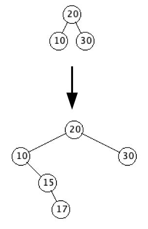

- Let's trace through what happens when we insert the key 20
- Initially the root node is null, so `x` and `y` are both null, and `z` is a new Node with just the key set to 20
- Since `x` is null, we immediately exit the while loop
- We then set `z.setParent(y)`, which is null
- We set the root of the tree to `z`, `setRoot(z)`, and exit
- And so, the first node that is added to any binary search tree becomes the root

**Example**

- Now let's create another binary search tree with key values 50, 25, 75, 15, 40, 60, 90, 10, 20, 30, 45, 55, 70, 80, 95, 8, 12, 28
- Let's trace through what happens when we add a new node to the above with a key of 29

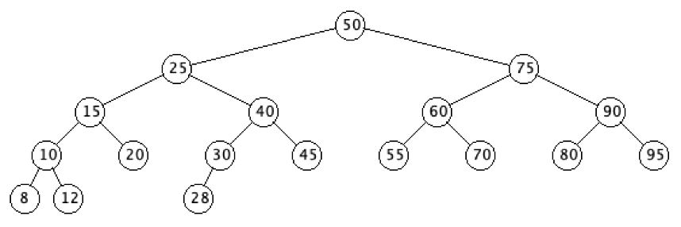

- Adding 29
  - Initially
    - z = (29,,,)
    - x = (50,,25,75)
    - y = (,,,)
  - The first pass through the while loop gives us
    - y = (50,,25,75)
    - x = (25,50,15,40), since 29 < 50
  - The second pass through the while loop gives us
    - y =  (25,50,15,40)
    - x = (40,25,30,45), since 29 > 25
  - The third pass through the while loop gives us
    - y = (40,25,30,45)
    - x = (30,40,28,), since 29 < 40
  - The fourth pass through the while loop gives us
    - y = (30,40,28,)
    - x = (28,30,,), since 29 < 30
  - The fifth pass through the while loop gives us
    - y = (28,30,,)
    - x = (,,,), since 29 > 28
  - Since x is null, we exit the while loop
  - Set z's parent to y
    - z.setParent(y), y = (28,30,,)
    - z = (29,28,,)
  - Since z.getKey() > y.getKey(), we add z as the right child of y
    - y.setRight(z), z = (29,28,,))
    - y = (28,30,,29)
  - We finally get the tree below

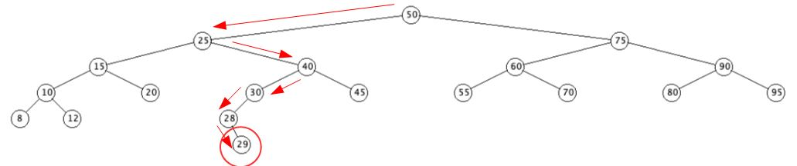

**getMax**

- The getMax function simply continues taking the right child of the current node until the right child is null
- Here is pseudo code for `public Node getMax(Node x)`
   - Since it takes a Node as a parameter, it can be used to get the maximum Node for any subtree
   - To get the maximum for the entire tree, use the root for x

```java
while(x.getRight() != null) // if x has no right child, done
    x = x.getRight() // .......update x to the right child of x
return x
```

**getMin**

- Just change `getRight` to `getLeft` in the loop above.

**getNode()**

- The getNode function returns the node that has a key equal to the key parameter
- The function is recursive, so it also takes a Node parameter, telling the function where it currently is in the tree
- The initial node parameter is the root of the tree
- Here is pseudo code for public Node getNode(Node x, int key)

``` java
if((x == null) or (key == x.getKey()))
    return x // ....................................we found the key or ran out of Nodes
if(key < x.getKey()) return getNode(x.getLeft(), key) // search left subtree
else return getNode(x.getRight(), key) // ...............search right subtree
```

- Below we search for 29 and 81. Obviously 81 is not found

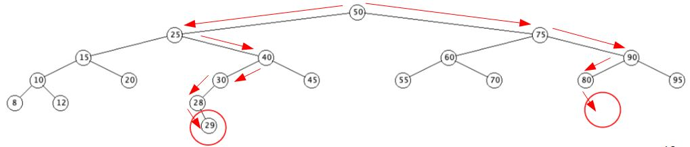

**General Considerations about trees and search**

- The tree only has one point of access--the root.
- Nodes can only be reached from the root by following the edges.
- If a Node is no longer a left or right subchild, it is unreachable
- Recursive algorithms that modify the links in the tree must be done very carefully


- Storing nodes in a search tree should be done to make `getNode` as efficient as possible.
- If a tree has all its Node stored on one long branch and there are `n` Nodes then it can take up to `n` steps to find a specific value.

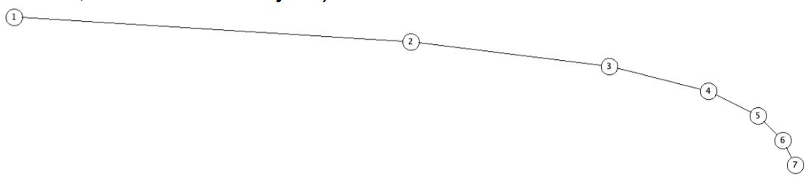

- We call this linear search and later we will see it denoted as O(n)
- If we have a perfectly balanced tree like the one below, then it takes at most 5 comparisons to either find the key we are looking for or that the key does not exist in the tree
= The log<sub>2</sub> of 15 is approximately 4, which is the number of nodes that need to be examined for a value that is not in the tree.
- We don't need to have a complete binary search tree for good result, we just need maximum length branches that are not similar in length  compared to the number of keys on the tree. The search is O(log n)
  - Once again, you will discuss algorithmic performance more in data structures and algorithms
  - There are algorithms for rebalancing trees

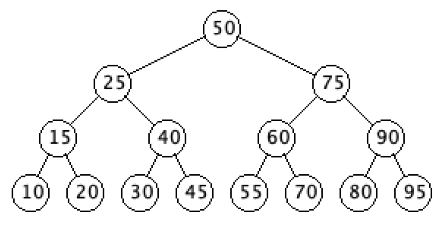

## Tree traversal
- The three tree walk methods are recursive and very simple to implement, to walk the entire tree, use the tree root as the parameter

**inOrderWalk(Node x)**
``` java
if(x != null)
    inOrderWalk(x.getLeft())
    Visit Node `x` // for us, this will equate to `System.out.println(x)`
    inOrderWalk(x.getRight())
```
**preOrderWalk(Node x)**
``` java
if(x != null)
  	Visit Node `x` // for us, this will equate to `System.out.println(x)`
  	preOrderWalk(x.getLeft())
  	preOrderWalk(x.getRight())
```
**postOrderWalk(Node x)**
``` java
if(x != null)`
    postOrderWalk(x.getLeft())
    postOrderWalk(x.getRight())
    Visit Node `x` // for us, this will equate to `System.out.println(x)`
```

**Successor**

- The successor function returns the "next" node in the tree, that is, the Node with the smallest key that is greater than the Node's key value
  - The basic idea is
     - If the Node has a right child, then return the minimum Node of the right subtree (we already saw `getMin`)
     - If the Node does not have a right child, then return the first ancestor of `x` in which `x` is in the Node's left subtree
        - This will be the first Node that has a key greater than `x`'s

``` java
getSuccessor(Node x)
    if(x.getRight() != null) return getMin(x.getRight())
    y = x.getParent()
    while((y != null) and (x == y.getRight()))
        x = y
        y = y.getParent()
    return y
```

- So, how do we know this works, there are two cases
  - `x` has a right child or right subtree
  - `x` does not have a right child or right subtree
- If `x` has a right child, then the Node in `x`'s right subtree having the smallest key, definitely has a key value greater than `x`'s
  - But could `x`'s successor be above it?
  - Everything above and to the left of `x` is smaller than `x`, so they can't be `x`'s successor
  - Everything above and to the right of `x` is larger than `x`, and everything in the subtree rooted at `x` is smaller than everything above and to the right of `x`, so they are all larger than all of the Nodes in the subtree rooted at `x`
  - So, if `x` has a right child, `getMin(x.getRight())` will give us `x`'s successor
     - This is not a proof


- If `x` doesn't have a right child, then we need to find an ancestor of `x` that is larger than `x`
- Any ancestor of `x` above and to the left of it will be smaller, so they can't be `x`'s successor
- Any ancestor above and to the right of `x` will be larger than `x`, so we need to get the smallest of those
  - As we trace back through `x`'s ancestors, the first one that has `x` in it's left subtree is larger than `x`
  - Everything above and to the left of that is smaller than `x`
  - Everything above and to the right of that is larger than the Node which is larger than `x`
    - This is not a proof
- Successor of 30
  - The first ancestor of 30 in which 30 is in the left subtree is 40
  - Everything above and to the left of 40 is smaller than 30
  - Everything above and to the right of 40 is larger than 40

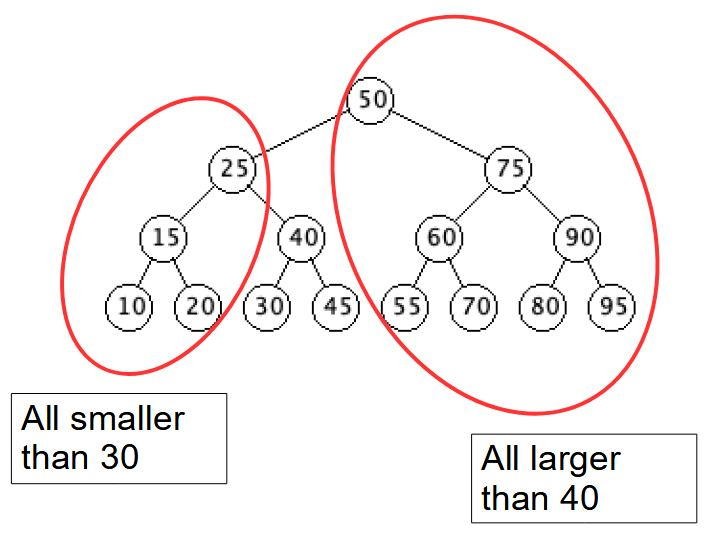

  - The first ancestor of 45 in which 45 is in the left subtree is 50

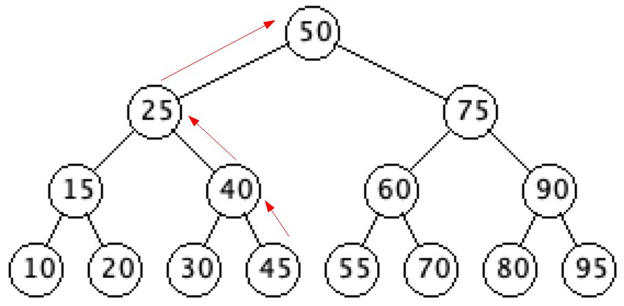

- Trace of successor of 45
  - First pass of while loop
    - x = 45 (right child of y)
    - y = 40
  - Second pass of while loop
    - x = 40 (right child of y)
    - y = 25
  - Third pass of while loop
    - x = 25 (left child of y)
    - y = 50
  - Exit while loop and return y = 50

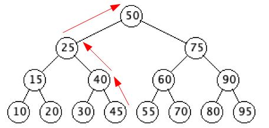

- Successor of 95
  - Since 95 is the max Node, the while loop will exit when x becomes the root and y becomes null

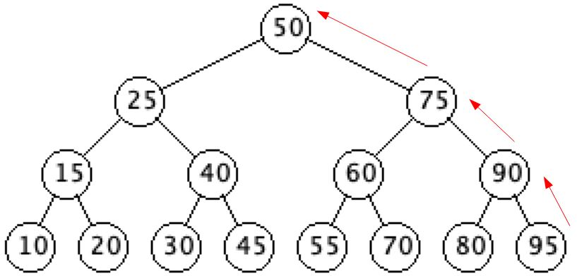

- Successor of 50
  - Since 50 has a right child, we simple return the min of it's right subtree

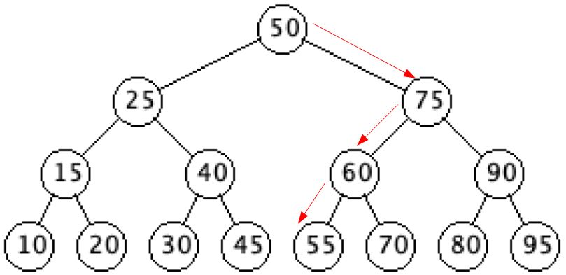

- The predecessor function returns the "previous" node in the tree
  - That is, the Node with the largest key that is less than the Node's key value
    - The basic idea is
      - If the Node has a left child, then return the maximum Node of the left subtree
      - If the Node does not have a left child, then return the first ancestor of x in which x is in the Node's right subtree
        - This will be the first Node that has a key less than x's

``` java
getPredecessor(Node x)
    if(x.getLeft() != null)
    return getMax(x.getLeft())
    y = x.getParent()
    while((y != null) and (x == y.getLeft())) // we either trace back to the
        x = y // ................................root of the tree or to the
        y = y.getParent() // ....................first ancestor of x that
    return y //..................................has x in it's right subtree
```

- So, how do we know this works, there are two cases
  - `x` has a left child or left subtree
  - `x` does not have a left child or left subtree
  - The `getPredecessor()` function is symmetric to the `getSucccessor()` function, swapping left/right and less than/greater than
- Predecessor of 50
  - Since 50 has a left child, we simple return the max of it's left subtree

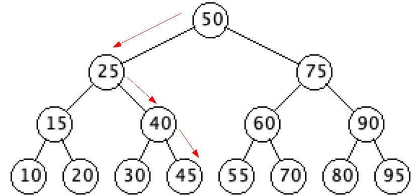

- Predecessor of 10
  - Since 10 is the min Node, the while loop will exit when x becomes the root and y becomes null

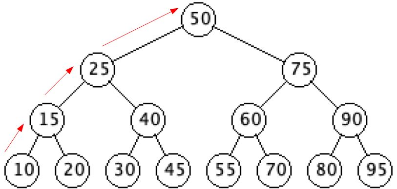

- Predecessor of 55
  - The first ancestor of 55 in which 55 is in the right subtree is 50

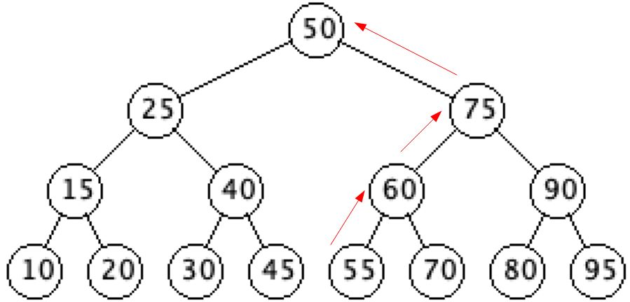

- Trace of predecessor of 55
  - First pass of while loop
    - x = 55 (left child of y)
    - y = 60
  - Second pass of while loop
    - x = 60 (left child of y)
    - y = 75
  - Third pass of while loop
    - x = 75 (right child of y)
    - y = 50
  - Exit while loop and return y = 50

**Deleting**

- There are two functions associated with deleting a node
  - `deleteNode(Node z)`
    - Delete Node `z` from the tree
  - `shiftNode(Node u, Node v)`
    - Replace Node `u` with Node `v`
    - The function is used by `deleteNode`
- There are three cases that our code needs to handle
  - `z` is a leaf
  - `z` has a single child
  - `z` has two children
- Removing a Node with no children (a leaf)
  - To remove a leaf, such as Node 45 or Node 55
    - We simply set the Node's parent's applicable child to null
    - To delete 45, since 45 has no children and it is the right child of 40, we set the right child of 40 to null
    - To delete 55, since 55 has no children and it is the left child of 60, we set the left child of 60 to null
  - The `deleteNode` function does the above indirectly through the `shiftNode` method
    - To delete 45, we do `shiftNode(z, z.getRight())`, `z = Node 45`
    - To delete 55, we do `shiftNode(z, z.getLeft())`, `z = Node 55`

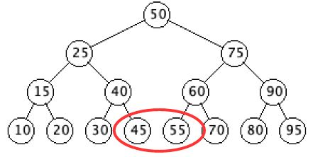

- Removing a Node with one child
  - To remove a node with a single child, such as Node 40 or Node 60
    - We replace the node being deleted with it's only child
    - To delete 40, we set 25's right child to 30
      - Since everything in 25's right subtree is greater than 25, replacing node 40 with node 30 maintains the key relationships of the binary search tree
    - To delete 60, we set 75's left child to 70
      - Since everything in 75's left subtree is less than 75, replacing node 60 with node 70 maintains the key relationships of the binary search tree      

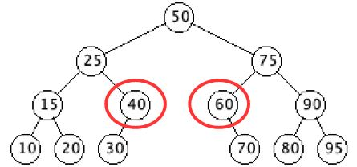

  - To delete 40, we set 25's right child to 30
     - This is done indirectly via `shiftNode(z, z.getLeft())`, `z = Node 40`
  - To delete 60, we set 75's left child to 70
     - This is done indirectly via `shiftNode(z, z.getRight())`, `z = Node 60`
- Removing a Node with two children
  - We will return to this case once we have discussed the `shiftNode` function

**shiftNode**

- The `shiftNode` function is used to replace one node with another node
  - It is only used by the `deleteNode` function
  - `shiftNode` does not restructure the whole tree, it just groups some of the steps in a separate method
- The function takes two parameters, `Node u` and `Node v`
- The function replaces Node `u` with Node `v`
- There are two cases
  - `u` is the root
    - Make `v` the root
    - Set `v`'s parent to be `u`'s parent
  - `u` is not the root
    - If `u` is the left child, make `v` the left child of `u`'s parent
    - If `u` is the right child, make `v` the right child of `u`'s parent
    - Set `v`'s parent to be `u`'s parent
- Pseudo code for `shiftNode(Node u, Node v)`

``` java
if(u.getParent() == null) // ...................u is the root
      setRoot(v) // ............................make v the root
else
      if(u == u.getParent().getLeft())
              u.getParent().setLeft(v) // ......u is left child
      else
              u.getParent().setRight(v) // .....u is right child

if(v != null)
      v.setParent(u.getParent()) // ............set v's parent
```

- Back to removing a Node with two children
  - The node that is being removed, `z`, will be replaced by it's successor
    - There are two cases
      - `z`'s successor is not it's right child
        - This mean that `z`'s right child has a left child
        - `z`'s successor has no left child, so we replace it with it's right child, and then replace `z` by it's successor
      - `z`'s successor is it's right child
        - This means that `z`'s right child has no left child, and it can directly replace `z`
  - We are going to delete Node 50
    - It's successor is 75
    - Since 75 is 50's right child, 75 has no left child, and so it can directly replace 50

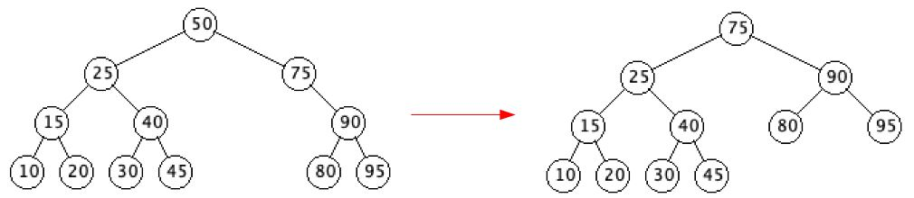

  - We are going to delete Node 50
    - It's successor is 60
    - Since 60 is not 50's right child, we replace 60 with it's right child (60 has no left child), 70, and then replace 50 with 60
      - 60 cannot have a left child, since that would mean that 60 was not 50's successor

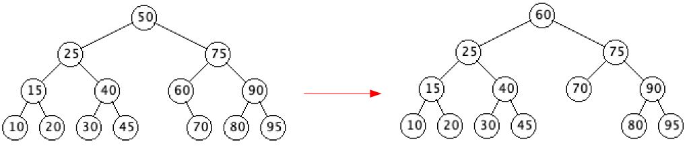

- `deleteNode(Node z)` pseudo code

``` java
if(z.getLeft() == null)					// if 0 or 1 children
    shiftNode(z, z.getRight())			// directly replace z with child
else
    if(z.getRight() == null)				// if 1 child
        shiftNode(z, z.getLeft())			// directly replace z with child
    else									// 2 children
        y = getSuccessor(z)				// get z's successor, y
        if( y.getParent() != z )			// y is not z's child
            shiftNode(y, y.getRight())	// replace y with right child
            y.setRight(z.getRight())		// update z's former right child
            y.getRight().setParent(y)	// update z's former right child
        shiftNode(z, y)					// replace z with y
        y.setLeft(z.getLeft())				// update z's former left child
        y.getLeft().setParent(y)			// update z's former left child
```

- Simulation that uses getPredecessor instead of getSuccessor: https://www.cs.usfca.edu/~galles/visualization/BST.html

**Height**

- The height of a tree is the maximum number of steps from the root of the tree to any of the leaves of the tree
	- An empty tree has height -1
	- A tree consisting of just the root has height 0
- The `getHeight(Node x)` method returns the height of the subtree rooted at x by recursively calculating the height of x's left and right subtrees
- To get the height of the tree, we get the height of the root of the tree
- Here is the pseudo code for getHeight(Node x)

``` java
if( x == null )
		return -1

leftHeight  = getHeight(x.getLeft())
rightHeight = getHeight(x.getRight())

if( leftHeight > rightHeight )
		return leftHeight + 1

return rightHeight + 1
```

**Tree walks**

- The final three functions are second versions of the tree walks that fill in an `ArrayList<String>` of the String representation of the Node in the walk order instead of printing the String representation to the screen
- Since the tree walks are recursive, we don't see a reasonable way to have them return the appropriate information as a return value
- So, we will pass them an initially empty `ArrayList<String>` and instead of doing `System.out.println()` for the current Node, we will do `ArrayList.add()` for the current Node
- The initial call to the tree walks will pass the starting Node, the root for a full tree walk, and an initialized `ArrayList<String>`
- The second three tree walk methods pseudo is below

``` java
inOrderWalk(Node x, ArrayList<String> nodeList)
    if( x != null )
        inOrderWalk(x.getLeft(), nodeList)
        Visit Node x // for us, this will equate to nodeList.add(x.toString())
        inOrderWalk(x.getRight(), nodeList)

preOrderWalk(Node x, ArrayList<String> nodeList)
    if( x != null )
        Visit Node x // for us, this will equate to nodeList.add(x.toString())
        preOrderWalk(x.getLeft(), nodeList)
        preOrderWalk(x.getRight(), nodeList)

postOrderWalk(Node x, ArrayList<String> nodeList)
    if( x != null )
        postOrderWalk(x.getLeft(), nodeList)
        postOrderWalk(x.getRight(), nodeList)
        Visit Node x // for us, this will equate to nodeList.add(x.toString())    
```


