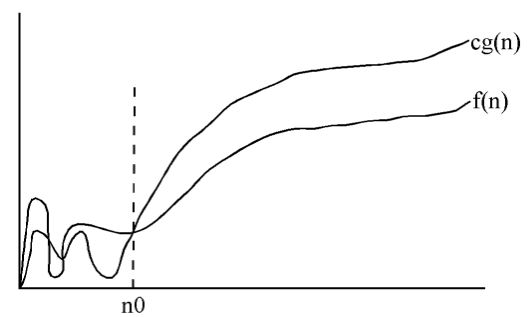

-------------------------
Computational Complexity
-------------------------

## Big Oh notation (or big oh notation)

- Big oh notation is used to provide an "asymptotic upper bound" for the performance of an algorithm
  - We typically think of runtime performance, but memory performance is also something that we can measure and are interested in
  - We are typically interested in the performance as the size of the input increases in size (or moves towards infinity)
  - We will stick to discussing runtime performance

## Definition
  - `f(n) = O(g(n))` if there exist positive constants `c` and n<sub>0</sub>, such that `f(n) ≤ c ∙ g(n)` for all `n ≥ n`<sub>0</sub>
- That is, the performance of `f(n)` is bounded above by `O(g(n))` (big oh of `g(n)`)



- **Note:** You will learn much more about big oh when you take algorithms

## Ranking of Time Complexities

- Smaller values are better than larger values
  - That is, O(1) < O(n) < O(n log n) < O(n<sup>2</sup>) … < O(n!) < …
- Individual instructions typically take ***constant time***, so `O(1)`
  - These are simple instructions versus method calls
  - If there was a built-in function for matrix multiplication, then that would not take constant time
- Non-nested loops typically take ***linear time*** based on the upper and lower bounds of the loop, so if the loop goes from 0 to `n-1`, we have `O(n)`
- Two non-nested loops, both going from 0 to `n-1`, would be `O(n)`, since we can get rid of the constant multiplier from our initial estimate of `O(2n)` (remember, `f(n) ≤ c ∙ g(n)`, `c` is a constant)
- Nested loops are ***multiplicative***. For example, the *nested* loops we had in our implementations of ***selection sort*** take O(n<sup>2</sup>)

## Selection Sort review

- Let's look at selection sort for a moment, below is pseudo code for it

```
1. j = 0
2. while j < X.length - 1
3.    min = j
4.    k = j + 1
5.    while k < X.length
6.        if X[k] < X[min] then
7.            min = k
8.        end if
9.        k = k + 1
10.   end while
11.   temp = X[j]
12.   X[j] = X[min]
13.   X[min] = temp
14.   j = j + 1
15.end while
```

## Selection sort analysis
- Line 1 is executed once
- The loop from 2 – 15 is executed n-1 times
  - n-1 times, since whatever is left after n-1 times is the maximum element and stays where it currently is
- The loop from 5 – 10 is executed (n-1) + (n-2) + ... + 1 = (n*(n-1))/2 = (n<sup>2</sup> - n)/2.
- The statement at line 7 is only executed some of the time, at most the same as loop from 5 – 10
- Lines 11 – 14 are executed n-1 times
- Although the amount of time this algorithm takes to execute on two arrays of size n may not be identical, the times will be similar.
- The difference between two runs of size n is how often line 7 executes. 
- **Note:** As we increase n, the length of time should increase.
- This is what we want to determine – ***how the algorithms run time changes as the input size increases***.
  - The time that the algorithm runs should be the sum of the time it takes for each statement to run multiplied by the number of times the statement executes.
  - Time for line 1 once
  - Time for lines 2, 3, 4, 11, 12, 13, 14, 15 n-1 times
  - Time for lines 5, 6, 8, 9, 10 (n<sup>2</sup> - n)/2 times
  - Time for line 7 at most (n<sup>2</sup> - n)/2 times
- We want to initially say the upper bound on performance is around 1 + 8(n-1) + 5(n<sup>2</sup> - n)/2 + 1(n<sup>2</sup> - n)/2
- We can get rid of the constant, since eventually there is an n large enough that the other lines take longer to execute
  - Let's assume that line 1 takes one hour to execute. Each other line takes 1 second to execute. We can also assume that we are looking at the worst case. That is, every statement executes the maximum number of times. So, we have `(8*(n-1)) + (5*((n*(n-1))/2)) + (1*((n*(n-1))/2))`. For n = 34, the time to do the other lines is slightly greater than 1 hour.
  - Now, lets assume that the time to execute the other lines is closer to 1 thousandth of a second. For n = 1,100 the time to do the other lines is slightly greater than 1 hour.
  - Now, lets assume that the time to execute the other lines is closer to 1 millionth of a second. For n=35,000 the time to do the other lines is slightly greater than 1 hour.
  - And finally, lets assume that the other lines take 1 billionth of a second to execute. For n=1,100,000 the time to do the other lines is slightly greater than 1 hour.
  - In the first case, we improve the performance of our computer by 1,000 times, yet an input of size less than 33 times the size of our previous input takes as much time to run. This improvement is similar when we increase the computer performance by 1,000 times two more times.
  - We note that 33 is close to the square root of 1,000, so we see that the n<sup>2</sup> is dominating the time.

  ## Takeaways

  - So, as we can see. Substantial increases in computer performance does not necessarily yield linear performance in problem size increases (i.e., we need to develop efficient algorithms).
  - We can also get rid of the n, since n<sup>2</sup> is larger and will eventually dominate the run time, no matter how long the instructions take to run that are executed n times
  - Now, (n<sup>2</sup> - n)/2 > n-1 for n >= 3. Thus for n >= 3, the number of times that lines 5, 6, 8, 9, 10 are executed is greater that any of the other lines. Thus, at some point there will be an n such that lines 5, 6, 8, 9, 10 take longer than any of the other lines (no matter how long any other individual line takes).
  - As n gets large, (n<sup>2</sup> - n)/2 is very close to n<sup>2</sup>. Thus this algorithm performance is related to n<sup>2</sup>, where n is the number of elements in
  the array to sort.

## More to come in Future Courses

- When you take algorithms, you will evaluate the performance of many algorithms and use other techniques to do the analysis
  - Such as when recursive functions are used
  - And multiple calls to process subsets of the input
    - Divide and conquer algorithms divide the input into smaller problems, and then solve the smaller problems, merging the results into a solution for the original problem
    - Quicksort uses this approach

## One other Thing

- One last thing to keep in mind, if we limit n to be less than a fixed value, then the runtime performance can be thought of as constant, O(1), since there is always a "c" and "n<sub>0</sub>" in which cg(n) is larger than f(n)
  - Since once n is larger than the upper limit for the size of the input, f(n) stops growing
- As a simple example, let's say we are going to sort a sample of data, but we are guaranteed that the sample will always be at most 50, whichever sorting algorithm we choose, there is a maximum time for any sample of size at most 50, so the sorting time is constant
