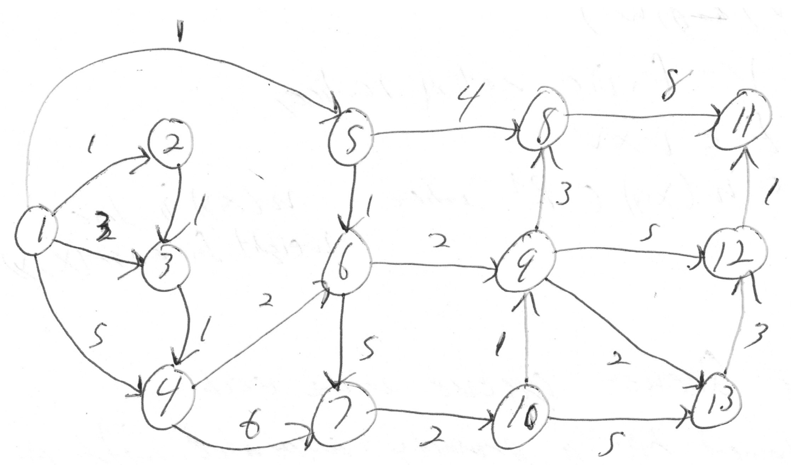

-----------------
Weighted Graphs
-----------------

## Definition of a weighted graph

**Definition:** We denote a ***weighted graph*** `G = (V,E)` where:
- `V` is a set of vertices
- `E` is a set of ***weighted*** edges, a subset of `V x V x R`
	- The third component is the ***weight*** of the edge.
	- On a diargram of a weighted graph, the weight is placed as a label on each edge.

## Graphs - Searching Algorithms

There are a couple of general graph search algorithms that are typically used for non-weighted graphs:
1. ***Breadth-first*** search - typically involves some queue
2. ***Depth-first*** search   - typically involves some stack. (Could entail recursion if you utilize the stack of the executable)

## Example of a Weighted Graph



## Breadth First Search

For the discussion below, assume the graph is ***directed*** (undirected is similar).

In the discussion below, we describe vertices being ***visited***. Sometimes, people refer to this as ***coloring*** the vertex, depending on the algorithm's context. It's just some indication that the vertex has been considered already, and shouldn't be revisited again.

- Let  `G = (V,E)` be a directed graph.
	- Initialize a queue `S` with the ***starting vertex*** and mark the starting vertex as ***visited***.
	- while `S` is not empty:
		- Remove the vertex from the front of `S`, call it `u`.
		- For each edge in `E`:
			- Let `(a,b)` be the current edge
			- If `a == u` and `b` is not yet ***visited***:
				- Add `b` to `S` and mark it as ***visited***.

- **Note:** Once `S` is empty, we have visited every vertex that can be reached from the starting vertex.
	- **Recall:** This is very similar to the way we searched for vertices in the `isConnected()` method from program 5.

***Breadth first search*** searches a graph by looking at vertices one edge (or steps) away from the starting vertex, then two edges or (steps) away from the starting vertex, and so on, until it either finds what it is looking for until it has searched all vertices that are reachable from the starting vertex.

## Depth First Search

Assume that the graph is ***directed*** (undirected is similar).

- Let `G = (V,E)` be a directed graph.
	- Initialize a stack `S` with the starting vertex and mark the starting vertex as ***visited***.
		- Pop the vertex off of the top of `S`, call it `u`.
		- For each edge in `E`:
			- Let `(a,b)` be the current edge
			- If `a == u` and `b` is not yet ***visited***:
				- Push `b` onto `S` and mark it as ***visited***.

- **Note:** Once `S` is empty, we have reached every vertex that can be reached from the starting vertex.

***Depth first search*** searches a graph by searching branches until they terminate, and then ***backtracking*** until there is an unsearched branch. Each unsearched branch is also searched it util it terminates, and continues this process until the entire tree is searched or until it finds what it is looking for.

## Searching a Weighted Graph

- **Note:** Breadth first and depth first searches do not take into account the edge weights.

- We want an algorithm that can return a ***shortest*** or ***lowest*** weight path between two vertices.
	- Breadth first search will return a ***shortest*** path, assuming all the edge weights are the same (and non-zero)

- ***Dijkstra's*** **single source shortest path** algorithm is a way to find a ***lowest weight path*** between a pair of vertices in a weighted graph. 
	- **Terminology:** We will use cost and weight interchangably for the following.

***Dijkstra's algorithm*** finds / builds a shortest path from the starting vertex to every vertex in the graph that is reachable from the starting vertex.

- There is a heuristic optimization of Dijkstra's algorithm called A* (pronounced A star).
- There is a dynamic version of it called D* (pronounced D star), that supports a dynamic graph, which is applicable to route planning in a dynamic environment.

- Either algorithm, Dijkstra's or A*, can be used to find a shortest path between vertices.
	- If there are multiple shortest paths, they will return one of the shortest paths a arbitrarily.
- We exit Dijkstra's algorithm once we have a shortest path to the ***destination vertex***.

- If the weights on the edges is the ***distance*** between the vertices, and the vertices are ***intersections*** from a map, and the edges are the ***roads***, then Dijkstra's algorithm will give a shortest route from the ***starting vertex*** to the ***ending vertex***.

## Dijkstra's Algorithm - the Basic rundown

### Explanation

- Let `G = (V,E)` be a directed weighted graph, where `E` is a subset of `V x V x R`<sup>+</sup>.
	- **Note:** `R`<sup>+</sup> is the set of real numbers that are greater than 0.

- Create a ***minimum priority queue*** `S`, adding all of the vertices of `G` to it, with each vertex, except for the starting vertex, having a cost of infinity (estimate of cost), and set the parent to undefined.
	- **Parent:** Refers back to which Node we reach the current node from along the path.
	- **Cost:** Refers to the sum of all the weights along the path from the start vertex to this vertex.
	- Note that as the algorithm runs, the values of the ***parent*** and ***cost*** are ***dynamic in nature***.
		- In other words, if we find a more optimal path along the way, the old values of the ***parent*** and ***cost*** will be ***obsolete and inferior***.
		- In such cases, both the ***parent*** and ***cost*** values will be updated to reflect the more optimal path found thus far.
	- **Our Goal:** We want to minimimize the ***cost*** for each vertex. 
		- If we can successfully do so, that indicates we have found the ***lowest cost path*** for every node.
		- If the ***costs*** represents distances between each node, then the ***lowest cost path*** is also going to correspond to the ***shortest path*** for every ***reachable*** node from our ***start vertex***.

- Add the starting vertex to `S` with a ***cost*** of `0` and set its ***parent*** to itself.
	- **Note:** A minimum priority queue orders the values from smallest to largest.
	- In our minimum priorty queue `S`, we use the ***cost*** as the priority (for sorting)
	- The ***cost*** of each vertex is the cost or ***sum of weights*** of the edges that form a path from the starting vertex to each of the vertices of the graph.

### Algorithm

- while `S` is not empty:
	- Remove the vertex with ***minimum cost*** and call it `u`.
	- If the parent value of `u` is defined:
		- For each edge `(a,b,w)` in `E`:
			- if `u == a`:
				- if the ***cost*** of `u + w` is less than the ***cost*** of `b`:
					- Update the ***cost*** of `b` to the ***cost*** of `u + w` and set the parent of `b` to `u`

- **Note:** Dijkstra's algorithm uses the fact that shortest / lowest cost paths contain shortest / lowest cost paths.
	- That is, if (u, x<sub>1</sub>), (x<sub>1</sub>, x<sub>2</sub>), ... , (x<sub>n</sub>, v) is a shortest / lowest cost path from `u` to `v`:
		- then each of the paths from (x<sub>i</sub>, x<sub>j</sub>) must be a shortest / lowest cost path 
		- otherwise we could use a shorter / lower cost path from x<sub>i</sub> to x<sub>j</sub> to reduce the ***cost*** of the path from `u` to `v`
			- this would contradict our shortest / lowest cost path from `u` to `v`

### Notes on Dijkstra's algorithm

- Dijkstra's algorithm starts with the shortest path from the starting vertex to itself in `S` (cost is 0).
- Each time we remove a vertex from `S`, it has a shortest path from the starting vertex of those vertices still in `S` (if the parent value is defined, otherwise there is no path)

**Potentially reducing the cost**

- Using the current vertex removed from `S`, which has a shortest path to it, of those vertices still in `S`:
	- We check if the path through the current vertex can reduce the path cost to the vertices that have an edge from the current vertex.
		- If the path cost can be reduced, we reduce it, and update the parent of the updated vertex.

**Recovering the path from the start vertex - Utilize the Parents we are tracking**

- When a vertex is removed from `S`, the cost associated with the vertex is the path cost from the starting vertex to the vertex just removed from `S`, and the parent values can be used to find the path from the starting vertex.

- The path to the starting vertex can be recovered using the parent values.
	- That is, for any vertex `u`, if the parent value of `u` is defined, the path from `u` to the starting vertex can be found by:

``` java
let x = u
while( parent[x] is not the starting vertex ):
{
	let x = parent[x] 
	//Add code here to keep track of the x values
}	
```

- **Note:** Once the loop ends, we have a path from `u` to the starting vertex, and we just need to reverse it to get a shortest path from the starting vertex to `u`.


## Program Assignment 06

For program assignment 06, we will be:
1. Constructing / defining
	- `WeightedGraph` class that `implements` the `WeightedGraphFunction` interface.
2. `WeightedGraphFunction` interface
	- Specifies the functions a `WeightedGraph` needs to implement
3. `WeightedEdge` class
	- Adds weight to the edges, can extend `Edge`
4. `CostVertex` class
	- A pair that associates the path cost from the starting vertex to the current vertex. 
	- This is the object that will be put into the min priority queue `S`
5. `CostVertexCompartor`
	- Class that implements the `Comparator` interface and is used to sort the `CostVertex` class by cost.
6. `WeightedEdgeComparator`
	- Class that implements the `Comparator` interface and is used to sort the `WeightedEdge` class by weight.
7. Implement the `WeightedGraph` functionality and `WeightedGrapFunction` interface required functions

### Utilizing a Priority Queue

- **Recall:** This should all be review from lab07

- [See Java `PriorityQueue`](https://docs.oracle.com/javase/7/docs/api/java/util/PriorityQueue.html)
- Supports maintaining a list of values in sorted order
	- Unlike `TreeSet`, there is no requirement to not have duplicates
	- Has methods to add objects, remove objects, and retrieve and remove objects
	- When we update the path cost for a vertex in the minimum priority queue `S`, we will remove it, update the cost, and re-add it
- [See `Comparator` interface](https://docs.oracle.com/javase/8/docs/api/java/util/Comparator.html)
	- Interface that specifies functions to support using the class for comparisons
	- For the two classes that `implement` the `Comparator` interface, I only needed to implement ```public int compare(CostVertex o1, CostVertex o2) ``` to get the minimum priority queue functionality that I wanted.