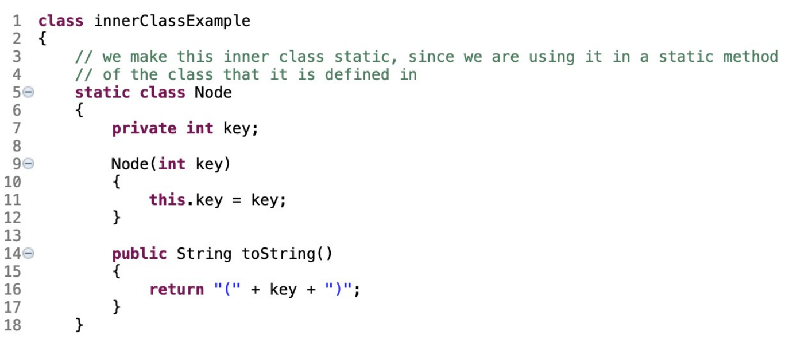
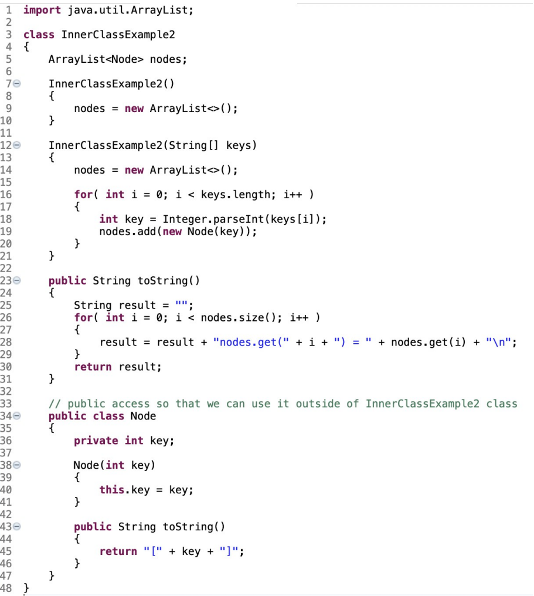
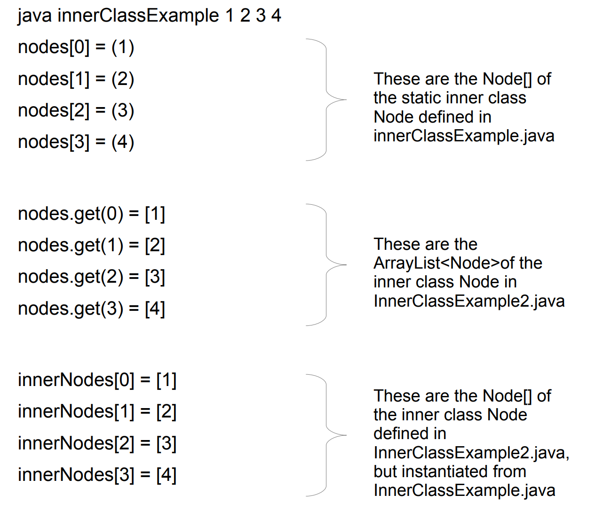

--------------------------
Nested and Inner classes
--------------------------

- An ***inner class*** is a class defined within an other class.
- It can be accessed outside of the surrounding class if it is `public`
- This is a nice option if you have a class that won't be used anywhere else
- Such As:	
	- The `Node` class in the binary search tree program
	- The `WeightedEdge` class in the weighted graph program
	- The `WeightedVertex` class in the weighted graph program

## Example inner classes

- We create a `static` inner class (technically it is a ***nested class***) that is used within the `public static main(String[] args)` method of the class.
	- That is, since we are going to use the inner `Node` class within the static `main()` of `innerClassExample`, we need to make the inner class `Node` `static`.



- We make a `public` inner class that we will access from a class outside of the enclosing class
- Since the innner class needs to be accessible from outside of the enclosing class, it must be `public`



- Now we have two classes
1. `InnerClassExample.java`
	- has a static inner class named `Node`
2. `InnerClassExample2.java`
	- has an inner class named `Node`

- In `InnerClassExample.main()` we are going to do four things
1. Allocate an array of the static inner class `Node` and instantiate them with the keys provided on the command line
2. Allocate a copy of `innerClassExample2` which has an `ArrayList` of it's inner class `Node` with the same keys
3. Allocate an array of `innerClassExample2.Node` with the same keys
4. Then print to the screen the three lists of `Nodes`

```java

public static void main(String[] args)
{
	//Array of the static inner Node
	Node[] nodes = new Node[args.length];

	//ice2 contains an ArrayList of the inner Node class, inside InnerClassExample2
	InnerClassExample2 ice2 = new InnerClassExample2(args);

	//We need a copy of InnerClassExample2 to reach it's inner Node
	InnerClassExample2 ice2b = new InnerClassExample2();

	//Array of inner class Node from InnerClassExample2, accessed from outside of InnerClassExample2
	//Note here that this allocation is completely separate from the fields that reside within the InnerClassExample2 class
	InnerClassExample2.Node[] innerNodes = new InnerClassExample2.Node[args.length];

	//Populate the two arrays.
	for(int i = 0; i < args.length; ++i)
	{
		int key = Integer.parseInt(args[i]);
		nodes[i] = new Node(key);				//construct Node instance via constructor residing in InnerClassExample
		innerNodes = ice2b.new Node(key);		//construct Node instance via constructor residing in InnerClassExample2
	}

	//Print the static inner Node array
	for(int i = 0; i < nodes.length; ++i)
	{
		System.out.println("nodes[" + i + "] =" + nodes[i]);
	}

	//Print the Arraylist of inner nodes, the field held within the InnerClassExample2 class.
	//We do so by leveraging the toString() method defined fro the InnerClassExample2 class.
	System.out.println(ice2);

	//Print the Node array of inner nodes, InnerClassExample2.Node[]
	for(int i = 0; i < innerNodes.length; ++i)
	{
		System.out.println("innerNodes[" + i + "] =" + innerNodes[i]);
	}
}
```

## Output 



---------------------------------------------------
Small caveats with Nested classes and Inner classes
---------------------------------------------------

The following information is from the Java Tutorials regarding nested classes, [which you can find here.](https://docs.oracle.com/javase/tutorial/java/javaOO/nested.html)

### Formal Definition


- The Java programming language allows you to define a class ***within another class***. 
- Such a class is called a ***nested class*** and is illustrated here:

```java
class OuterClass {
 ...
 class NestedClass {
 ...
 }
}
```

### Inner vs Static Nested classes

- **Terminology:** ***Nested classes*** are divided into two categories: 
	1. non-static and 
	2. static. 

	- Non-static nested classes are called ***inner classes***. 
	- Nested classes that are declared static are called ***static nested classes***

### Nested Classes are members

- A nested class is a member of its enclosing class. 

### Access Differences

- Non-static nested classes (inner classes) ***have access to other members*** of the enclosing class, ***even if they are declared private.*** 
- Static nested classes ***do not have access to other members*** of the enclosing class. 

### Access modifiers for Nested Classes

- As a member of the `OuterClass`, a nested class can be declared private, public, protected, or package private. 
	- (Recall that outer classes can only be declared public or package private.)

### Inner classes are tied to an instance of the Outer class

- As with instance methods and variables, an inner class is ***associated with an instance*** of its enclosing class and has ***direct access*** to that object's methods and fields. 
- Also, because an ***inner class*** is associated with an instance, ***it cannot define any static members*** itself.
- Objects that are instances of an inner class exist within an instance of the outer class. Consider the following classes:

``` java
class OuterClass {
 ...
 class InnerClass {
 ...
 }
}
```
- An instance of `InnerClass` can exist only within an instance of `OuterClass` and has ***direct access*** to the methods and fields of its ***enclosing instance***.

### Inner Class Instantiation

- To ***instantiate*** an inner class, ***you must first instantiate the outer class***. 
- Then, create the inner object within the outer object with `this`
- syntax:

```java
//instantiate the outer class first
OuterClass outerObject = new OuterClass();	

//then instantiate the inner class using the outerObject instance
OuterClass.InnerClass innerObject = outerObject.new InnerClass();	
```

### Notes on Static Nested classes

- As with class methods and variables, a ***static nested class*** is associated with its outer class. 
- And like static class methods, a static nested class ***cannot refer directly*** to instance variables or
methods defined in its enclosing class : it can use them only through an object reference
