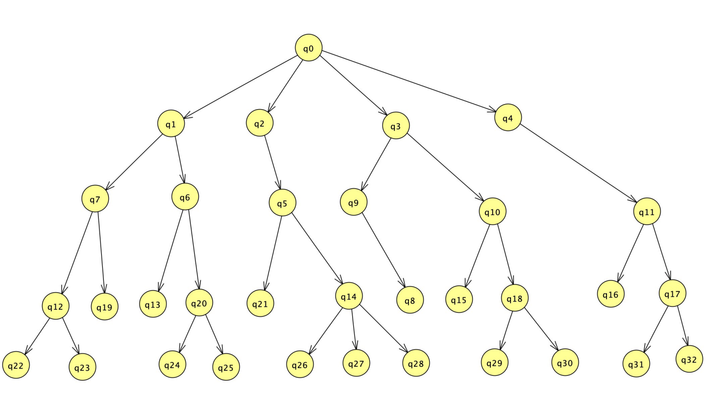
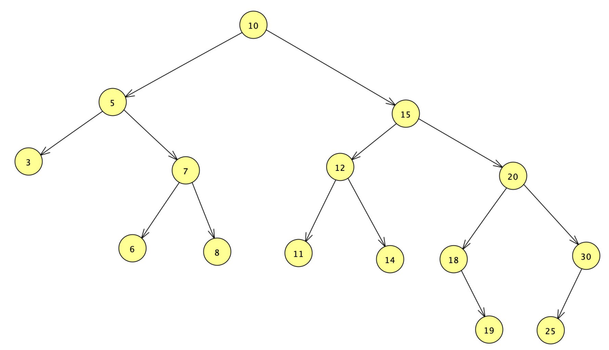

----------------------
Lists, Maps, Trees
----------------------

## The List interface 

- A class implementing the List interface supports the storage of an ***ordered collection of objects***
- An application using a class implementing the interface has control over where each element is added to the list
- An application using a class implementing the interface can access elements by the position, or index, in the list of elements
- An implementing class can have duplicate elements

### List Methods include

| Method | Description |
| ------ | ----------- |
| `add(int index, type element)` | add element to the list at the specified index |
| `add(type element)` | add to end of the list |
| `clear()` | delete all elements of the list |
| `contains(Object obj)` | check if an object is on the list |
| `get(int index)` | return the element at index index |
| `indexOf(Object obj)` | return the index of an object in the list |
| `remove(int index)` | delete an element from the list |
| `set(int index , type element)` | assign the element at index index the value element |
| `size()` | the number of elements in the list |
| `sort(Comparator comp)` | sorts the list based on the passed in Comparator |
| `toArray(type T[] array)` | converts the list to an array |

### Some of the implementing classes

- `AbstractList`
- `AbstractSequenctialList`
- `ArrayList` 
	- we have used these, a growable “array” of objects (equivalent to a Vector, except no thread safe)
- `AttributeList`
- `CopyOnWriteArrayList`
- `LinkedList` 
	- a doubly linked list, the first and last elements are known and the next and previous are also known
- `RoleList`
- `RoleUnresolvedList`
- `Stack` 
	- we've discussed the ArrayDeque version of a stack
- `Vector` 
	- we have discussed these, a growable “array” of objects (equivalent to an ArrayList, except thread safe)

## The Map interface

- Classes that implement this interface support ***mapping keys to values***
- keys are unique and can map to a single value
- values can be duplicated, with multiple keys mapping to the duplicate values
- That is keys “1” and “2” can both map to two copies of the same object 

### Map Methods include

| Method | Description |
| ------ | ----------- |
| `clear()` | remove all elements |
| `containsKey(Object objKey)` | check for existence of a key. This should be fast |
| `containsValue(Object objValue)` | check for the existence of a value. This should be slower than `containsKey()` |
| `get(Object objKey)` | return the value assoicated with the key |
| `isEmpty()` | Returns whether map is currently empty. |
| `keySet()` | Returns the collection of keys |
| `put(keyType key, valueType value)` | add a key and value pair to the map |
| `remove(Object objKey)` | remove the key and value pair from the map |
| `size()` | number of key/value pairs in the map |
| `values()` | return the collection of values |

### Some of the implementing classes

- `AbstractMap`
- `Attributes`
- `HashMap` 
	- uses the hash of the key as an “index”
	- Not synchronized
- `HashTable`
	- uses the hash of the key as an “index”
	- Is synchronized
- `TreeMap` 
	- the keys are stored in sorted order in a tree
	- Not synchronized
- In Dijkstra's algorithm, we could have stored the parent or cost of a vertex in a `HashMap` or `HashTable` or `TreeMap`
	- `TreeMap<<Integer>, <Double>>` or `TreeMap<<Integer>, <Integer>>` for the weight or parent respectively

### Details on hashing functions

- [From Wikipedia:](https://en.wikipedia.org/wiki/Hash_function)
	- A hash function is any function that can be used to map data of arbitrary size to fixed-size values. The values returned by a hash function are called hash values, hash codes, digests, or simply hashes. The values are usually used to index a fixed size table called a hash table. Use of a hash function to index a hash table is called ***hashing*** or ***scatter storage addressing***.
- The same piece of data will be mapped to the same hash code
- **Note:** Two pieces of data having the same hash code does not imply that the two pieces of data are the same
	- This is due to mapping a large number of values to a smaller number of values
		- Such as mapping 1,000,000,000 to 1,000 values, there are going to be multiple values mapped to a single hash (by the ***pigeon hole principle***)

## Trees

Some quick review:

- A tree is a directed graph, with some additional constraints
	- If `(u, v)` is an edge from `u` to `v`, then `u` is called `v's` ***parent***, and `v` is called `u's` ***child***
	- A node can have only one parent
	- If a tree has a ***root***, then the root has ***no parent***
	- A node that has no children is called a ***leaf*** (or ***external node***)
	- There is only one root node
	- The ***ancestors*** of a node are all the nodes that can be reached by ***repeatedly looking at the parent nodes***
	- The ***descendants*** of a node are all the nodes that can be reached by ***repeatedly looking at the child nodes***
	- A ***subtree*** is a node and all of its ***descendants***
	- An ***internal node*** is any node with child nodes

- Trees can be used to represent hierarchical data
	- The directory structure of a file system is a good example of this
	- Family trees (have to deal with the two parent thing though)

### Example of a tree

- In this example, q0 is the root of the tree

### Some of the implementing classes

Java has multiple tree implementations

- `TreeMap`
	- Stores the keys in a tree in sorted order
- `TreeSet`
	- Stores objects in a tree in sorted order
- `JTree`
	- Display hierarchical data

### Binary search tree

- [From Wikipedia:](https://en.wikipedia.org/wiki/Binary_search_tree)
	- In computer science, a ***binary search tree (BST)***, also called an ***ordered or sorted binary tree***, is a rooted binary tree data structure whose internal nodes each store a key ***greater than*** all the keys in the node’s ***left subtree*** and ***less than*** those in its ***right subtree***.

### Example

- To find an element, takes at most 5 comparisons versus 15 in an array

