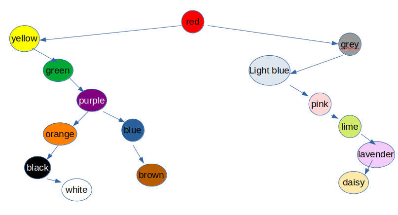
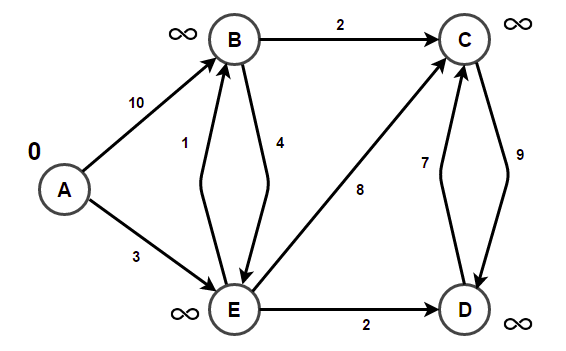

-------------------
Quiz 3 / 4 Review
-------------------

**Disclaimer:** This is not intended to be an exhaustive list of everything you need to know for the upcoming quiz. Anything from lecture notes, labs, and program assignments is fair game.

# Binary Search Trees

BSTs will be tested ***heavily*** for the quiz. With that in mind, here are some questions.

## Q1: Consider a BST which holds keys 1 through 15 in it.

1. What is the smallest possible height such a BST could have?
2. What is the maximum possible height such a BST could have?
3. Draw the BST such that the height is minimized.
4. Assuming we start with an empty BST, list an order the keys could be entered into the BST such that it would result in the BST you drew. 
	- **Note:** There are various answers that could work here.
5. What is the root's key of the BST you drew?
6. What are the key's of the root's left and right children of the BST you drew?
7. From left to right, what are the key's of the leaf nodes of the BST you drew?

## Q2: Consider the following BST, where the keys are not explicitly known.



### Successors

1. Which node represents the successor of the green node?
2. Which node represents the successor of the red node?
3. Which node represents the successor of the brown node?
4. Which node represents the successor of the lime node?

### Predecessors

5. Which node represents the predecessor of the orange node?
6. Which node represents the prdecessor of the red node?
7. Which node represents the predecessor of the light blue node?
8. Which node represents the predecessor of the purple node?

### Deletion

Assume deletion of a node ***with two children*** involves utilizing the ***successor***, same as we did when implementing our BST for the associated program assignment.

Assume each deletion is an ***isolated event*** in the questions below. In other words, assume the tree is in its shown state for each question, and the deletes ***do not persist*** from one question to the next.

**Note:** If we delete the light blue node, since it only has one child, we do **NOT** utilize the successor nor the predecessor. When deleting a node with only one child, we simply replace the deleted node with its lone child.

When answering "how would the BST's structure change" below, consider the following:
- which colored node will replace the node being deleted?
	- describe the replacing node's new parent / any new children as well.
- which colored node, if any, will shift to replace the node that's replacing the deleted node?
	- describe the shifted node's new parent / any new children as well.

9. If we delete the root of the BST:
	- How would the BST's structure change?
10. If we delete the yellow node:
	- How would the BST's structure change?
11. If we delete the green node:
	- How would the BST's structure change?
12. If we delete the lime node:
	- How would the BST's structure change?
13. If we delete the purple node:
	- How would the BST's structure change?
14. If we delete the pink node:
	- How would the BST's structure change?
15. If we delete the orange node:
	- How would the BST's structure change?
16. which colored nodes could be deleted, such that no nodes would need to replace them?


# Recursion

Q1. Consider the following recursive function:

``` java
public static int collatz(int n)
{
	if(n == 1)
	{
		return n;
	}
	else if(n % 2 == 0)
	{
		return collatz(n / 2);
	}
	else
	{
		return collatz(3 * n + 1);
	}
}
```

1. What is the value of collatz(7)?
	- Draw out a stack trace describing the recursive calls involved.
2. What is the value of collatz(1024)?
	- Draw out a stack trace describing the recursive calls involved.
3. What is the value of collatz(21)?
	- Draw out a stack trace describing the recursive calls involved.
4. Are there any values that would garauntee StackOverflow occurs here?
	- If so, give an example.
	- If not, explain why not.

Q2: Consider the following recursive function:

``` java
public static ArrayList<String> foo(String s)
{
	ArrayList<String> ret = new ArrayList<>();

	if(s.length() == 0)
	{
		ret.add(s);
	}
	else
	{
		ArrayList<String> strings = foo(s.substring(1, s.length()));

		for(String str : strings)
		{
			if(!ret.contains(str))
			{
				ret.add(str);
			}

			if(!ret.contains(s.charAt(0) + str))
			{
				ret.add(s.charAt(0) + str);
			}
		}
	}

	Collections.sort(ret); //sorts in ascending order, lexicographically.
	return ret;
}
```

1. What ArrayList is returned if we pass in ""?
2. What ArrayList is returned if we pass in "J"?
3. What ArrayList is returned if we pass in "to"?
4. What ArrayList is returned if we pass in "cat"?
5. What ArrayList is returned if we pass in "abcd"?
6. Given a string of length `n`, how many elements will be in the returned list?
7. What would be a better name for the function `foo` that describes what this recursive function is doing?
	- **Note:** There are probably a few names that could make sense here.

# Weighted Graphs and Shortest Paths

Q1: Consider the following directed, weighted graph. [Source material taken from here.](https://www.techiedelight.com/single-source-shortest-paths-dijkstras-algorithm/)

- **Note:** We have already indicated the starting weights for each WeightedVertex.




0. Based on the starting weights for each WeightedVertex, what are we considering as our source vertex here?

1. Find the shortest path from the source vertex to all other vertices.
2. What is the minimum cost to reach each vertex from the source vertex?
3. Give the shortest path from the source vertex to each other vertex.
	- Each shortest path should be an ordered list of edges.
4. Give the order in which the weights of vertex B change as Dijkstra's algorithm is performed.
	- **Note:** The order should correspond to how it would have been updated in the priority queue holding the WeightedVertex.
5. If we ran Dijkstra's algorithm for all possible destination vertices, what would the parent be for each destination vertex, assuming we are starting from the established source vertex?

# Comparators and Priority Queues

Q1: Suppose we are given the following `Toy` class:

``` java
class Toy
{
	double price;
	int    yearManufactured;

	public Toy(double p, int yM)
	{
		this.price = p;
		this.yearManufactured = yM;
	}

	public String toString()
	{
		return "$" + price + " (" + yearManufactured + ")";
	}
}
```

1. Create a `ToyComparator` which implements `java.util.Comparator<Toy>` such that the following requirements are met:
	- `Toy` objects are compared by the year they were manufactored first.
		- Whichever was made earlier, would be considered less than the other.
	- `Toy` objects are then compared by their prices if they were manufactored in the same year.
		- Whichever costs less, would be considered less than the other.
	- `Toy` objects are considered equal to one another if they were manufactured in the same year, and have the same price.

- **Hint:** Recall to implement a `Comparator`, it will look something like this:

``` java
class ToyComparator implements java.util.Comparator<Toy>
{
	public int compare(Toy t1, Toy t2)
	{
		//TODO - implement
	}
}
```

2. High level, what different type of integer values can be returned by the `compare()` method above? 
	- What do each of the different type of integer values indicate as far as ordering `t1` and `t2` goes? 

Q2: How would you instantiate a priority queue which orders `Toy` objects based on the `ToyComparator`?
- **Note:** You should be comfortable adding a few `Toy` objects to such a priority queue in any order, and then utilizing the priority queue to print the `Toys` out in order via the `Comparator`.


## Other Quiz Topics not covered explicitly here

### Older material covered before, but still relevant

- `instanceof`
- equality of objects
- auto boxing
- primitive types and sizes

### Newer material

- [`TreeMaps` and `HashMaps`](https://github.com/Binghamton-University-CS140-Fall-2022/lecture_notes/blob/main/29_hash_map_and_tree_map.md)
	- Know how to instantiate these
	- How do `TreeMaps` and `HashMaps` differ from one another?
	- How are `TreeMaps` and `HashMaps` similar?
	- Know how to utilize the methods to add entries and retrieve entries
		- **Recall:** This typically involves some key / value pairs.
